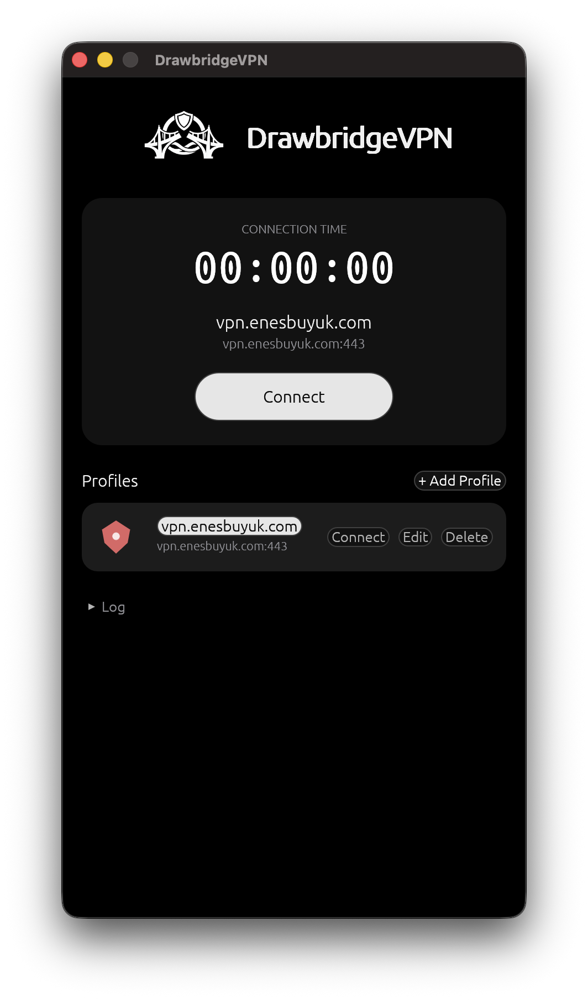
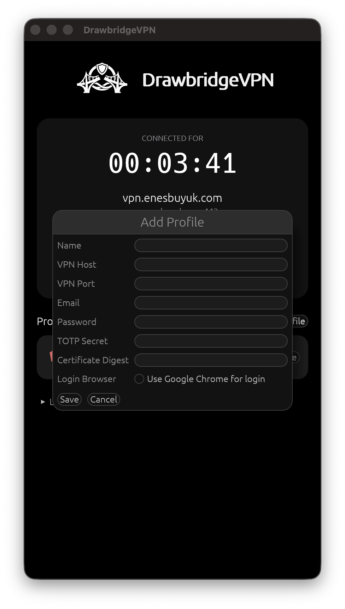
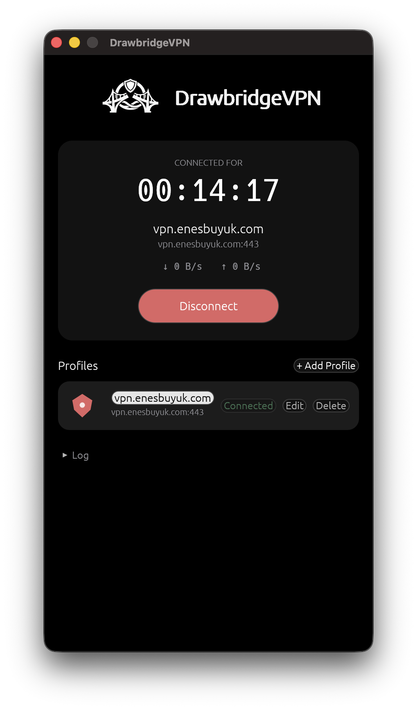

<div align="center">
  

  # DrawbridgeVPN

  
</div>

Company VPNs behind SAML/SSO + MFA are a chore: open browser, log in, wait
for push, dig phone out, type OTP, copy cookie, run VPN client. Do that every
morning and it gets old fast.

**DrawbridgeVPN** automates all of it. Give it your email, password and TOTP
secret once (stored in the macOS Keychain, never on disk), and one click
does the whole login + MFA + cookie handoff + tunnel-up sequence for you.

Currently supports **Microsoft/Entra ID SSO in front of a Fortinet
(FortiVPN) gateway**. Native macOS app, built in Rust.

## Table of Contents

- [Features](#features)
- [How it works](#how-it-works)
  - [Setting up a profile](#setting-up-a-profile)
- [Prerequisites](#prerequisites)
- [Installation](#installation)
- [Building and running](#building-and-running)
- [Project layout](#project-layout)
- [License](#license)

## Features

- Headless browser automation of the SAML/SSO + Microsoft MFA login flow, using an
  embedded `WKWebView` by default, or the Chrome DevTools Protocol (`chromiumoxide`)
  against a locally installed Google Chrome for profiles that opt in.
- Generates the TOTP code itself from the secret you provide; no phone,
  no authenticator app needed at connect time.
- Multiple profiles (different VPN hosts / accounts) with quick switching.
- Passwords and TOTP secrets live in the macOS Keychain only — never
  written to disk or config files.
- Live log panel showing exactly what step it's on (logging in, waiting
  for MFA, connecting VPN, connected, failed, ...).
- Starts/stops `openfortivpn` for you, handling the admin-privilege prompt.

## How it works

1. It drives an embedded WKWebView — part of macOS, no browser install
   needed — to the Microsoft login page at `https://login.microsoftonline.com/`
   — the same login screen your company VPN would normally bounce you to.
   (A profile can opt into driving a local copy of Chrome instead.)
2. It fills in your email and password, then handles the Microsoft MFA
   step by generating a one-time code from the TOTP secret stored in your
   profile (the same secret you'd otherwise pull off an authenticator app).
3. Once SSO succeeds, it captures the `SVPNCOOKIE` the gateway hands back.
4. It feeds that cookie straight into `openfortivpn` and brings the tunnel
   up — no manual copy/paste.

### Setting up a profile

- Add a profile with your VPN host, port and certificate digest (same
  values you'd normally give `openfortivpn`).
- Add your email + password for the Microsoft/Entra ID login.
- Add the TOTP secret for that account (the same secret used to set up
  an authenticator app — scan it once, save the underlying secret key
  into the profile instead of onto a phone).
- Save, select the profile, hit **Connect**.

<p align="center">
  
  
</p>

## Prerequisites

- macOS.
- [Google Chrome](https://www.google.com/chrome/) — optional, needed only by profiles with
  "Use Google Chrome for login" ticked. The default engine is built into macOS.
- `openfortivpn` installed:

  ```sh
  brew install openfortivpn
  ```

- Rust and Cargo (to build from source).

## Installation

1. Clone the repo:

   ```sh
   git clone https://github.com/enesbuyuk/DrawbridgeVPN.git
   cd DrawbridgeVPN
   ```

2. Install prerequisites above (`openfortivpn`, Rust/Cargo, Chrome if needed).
3. Build and launch the app:

   ```sh
   make start
   ```

   This builds a proper `.app` bundle (with Dock icon) and launches it. See
   [Building and running](#building-and-running) below for other targets.

## Building and running

```sh
make start      # builds a proper .app bundle (with Dock icon) and launches it
make run        # cargo run --release, for quick iteration while developing
make bundle     # just build the .app bundle without launching it
```

On first launch, the profile list is empty. Use **Add Profile** to create a
profile with your VPN host, port, email, certificate digest, password and
TOTP secret. The password and TOTP secret are saved to the macOS Keychain;
everything else is saved to `profiles.json`.

Select a profile and click **Connect** to run the SAML/MFA login flow and
start the VPN tunnel. Because `openfortivpn` requires root privileges, macOS
will prompt for administrator credentials via a native authorization dialog.
Click **Disconnect** to stop the tunnel.

## Project layout

- `src/main.rs` — application entry point.
- `src/app.rs` — the `eframe::App` implementation (profile list, edit form,
  connection controls, log panel).
- `src/profile.rs` — profile model and JSON-backed profile store.
- `src/secrets.rs` — macOS Keychain wrapper for passwords and TOTP secrets.
- `src/saml/` — the SAML/MFA browser automation flow and cookie capture.
- `src/vpn.rs` — privileged `openfortivpn` process management via
  `osascript`.
- `src/events.rs` — shared event types used to report progress from
  background threads to the UI.
- `packaging/Info.plist` — macOS app bundle metadata used by `make bundle`.

## License

GPLv3 — see [LICENSE](LICENSE).
